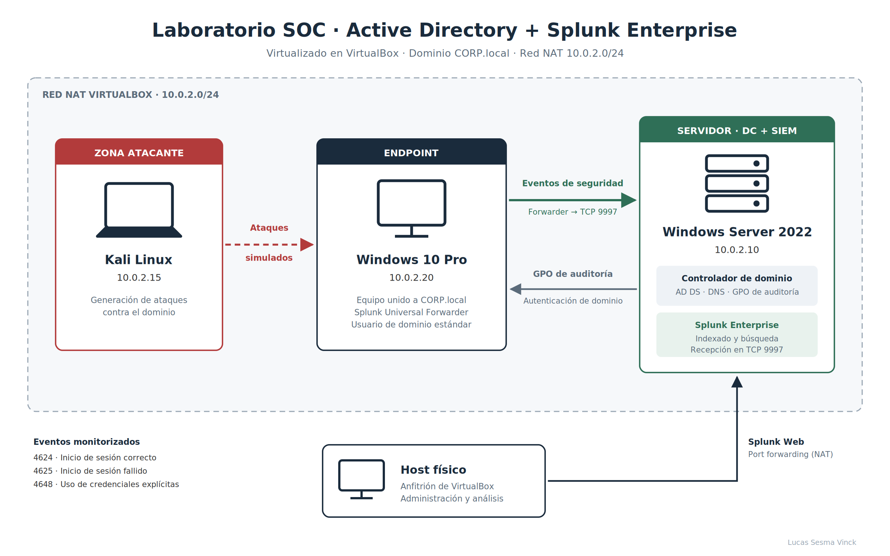

# Laboratorio SOC · Active Directory + Splunk Enterprise

Laboratorio de detección montado en VirtualBox para practicar operaciones de SOC desde el lado defensivo: un dominio Active Directory con auditoría configurada por GPO, un endpoint Windows que envía su telemetría de seguridad a Splunk Enterprise y una máquina Kali Linux desde la que se simulan ataques para detectarlos después en el SIEM.

## Componentes

| Máquina | IP | Función |
|---|---|---|
| Windows Server 2022 | 10.0.2.10 | Controlador de dominio (AD DS, DNS) del dominio `CORP.local` y servidor Splunk Enterprise |
| Windows 10 Pro | 10.0.2.20 | Endpoint unido al dominio, con Splunk Universal Forwarder |
| Kali Linux | 10.0.2.15 | Máquina atacante para generar actividad maliciosa |
| Host físico | — | Anfitrión de VirtualBox; acceso a Splunk Web mediante port forwarding |

Todas las máquinas virtuales comparten una red NAT de VirtualBox (`10.0.2.0/24`).

## Flujo de la telemetría

1. El controlador de dominio aplica una **GPO de auditoría** al endpoint para que registre los eventos de seguridad relevantes.
2. El **Universal Forwarder** del Windows 10 envía el Security Event Log a Splunk por **TCP 9997**.
3. **Splunk Enterprise** indexa los eventos y permite buscarlos y analizarlos desde Splunk Web.
4. Desde Kali se lanzan **ataques simulados** contra el dominio y se comprueba que la actividad queda registrada y es detectable en Splunk.

## Eventos monitorizados

| Event ID | Descripción |
|---|---|
| 4624 | Inicio de sesión correcto |
| 4625 | Inicio de sesión fallido |
| 4648 | Inicio de sesión con credenciales explícitas |

## Tecnologías

Windows Server 2022 · Active Directory · GPO · Splunk Enterprise · Splunk Universal Forwarder · Kali Linux · VirtualBox

## Autor

**Lucas Sesma Vinck** · [LinkedIn](https://linkedin.com/in/lucas-sesma-vinck) · [GitHub](https://github.com/Lucassesma)
